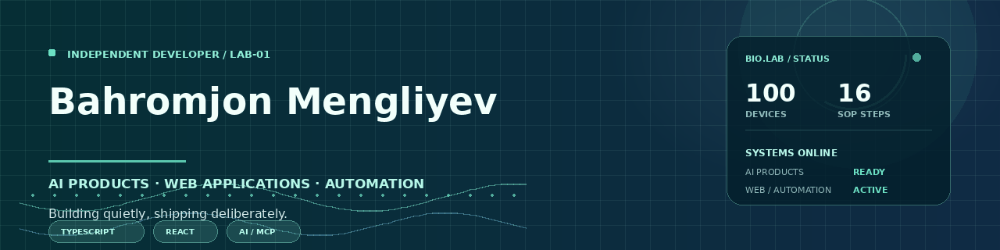

# Bahromjon Mengliyev

  

<a href="./assets/profile-banner.svg">View the lightweight SVG banner fallback</a>

### Independent Developer · AI Products · Web Applications · Automation

I build practical software at the intersection of **artificial intelligence, web applications, and automation**. My focus is turning complex ideas into useful products with clear interfaces, reliable integrations, and maintainable code.

## Current focus

- Shipping [BioLab Interactive Guide](https://github.com/uzme/biolab-interactive-guide) as a structured biotechnology learning platform.
- Building AI products with TypeScript, React, Supabase, RAG, and MCP integrations.
- Improving deployment, testing, documentation, security, and repeatable automation workflows.

Planning board: [Developer Roadmap](https://github.com/users/uzme/projects/1)

## Featured project

| Project | Description | Stack |
|---|---|---|
| [BioLab Interactive Guide](https://github.com/uzme/biolab-interactive-guide) | Interactive learning platform for exploring 100 biotechnology devices. | TypeScript · React · Vite · Express · Tailwind CSS |

## Selected repositories

- [BioLab Interactive Guide](https://github.com/uzme/biolab-interactive-guide) — an interactive educational product with a structured device catalogue and viewer experience.
- [Second Brain](https://github.com/uzme/second-brain) — an AI memory, knowledge base, RAG, chat, and controlled agent platform.
- [Manus ChatGPT Bridge](https://github.com/uzme/manus-chatgpt-bridge) — a secure MCP and REST bridge for AI client integrations.
- [Developer Portfolio](https://github.com/uzme/developer-portfolio) — a focused overview of AI products, web applications, and automation work.

## Technical interests

`TypeScript` `JavaScript` `React` `Node.js` `Vite` `Express` `Tailwind CSS` `REST APIs` `AI Products` `Automation` `Responsive UI`

## GitHub activity

  

## Languages

  

  

  

  
  
  
  
  

### Contribution activity

  

## Development principles

I value **useful products over unnecessary complexity**, secure handling of credentials, readable code, documented decisions, and interfaces that remain understandable for real users.

## Contact

For collaboration, product ideas, or technical conversations, connect with me on [Telegram](https://t.me/MengliyevBahrom), [Instagram](https://www.instagram.com/Mengliyev__Bahrom/), or [X](https://x.com/BioUZB).

---

> Building quietly, shipping deliberately.
