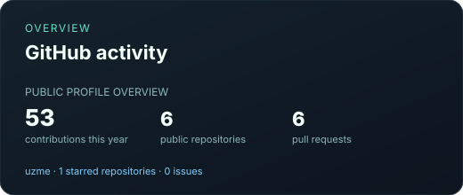
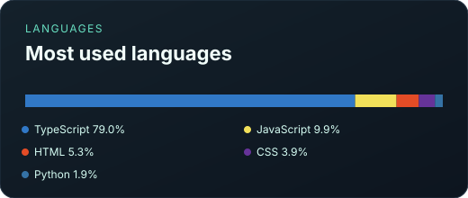
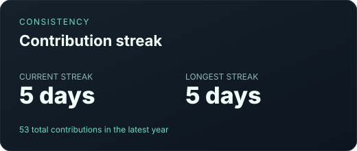
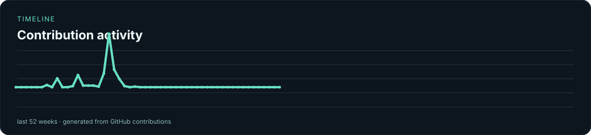

# Bahromjon Mengliyev

  

<a href="./assets/profile-banner.svg">View the lightweight SVG banner fallback</a>

### Independent Developer · AI Products · Web Applications · Automation

I build practical software at the intersection of **artificial intelligence, web applications, and automation**. My work focuses on turning complex ideas into useful products with clear interfaces, reliable integrations, repeatable delivery, and maintainable code.

> **Current direction:** product hardening for BioLab, a secure Phase 1 foundation for Second Brain, and API validation work for MCP Bridge. Follow the real work on the [Developer Roadmap](https://github.com/users/uzme/projects/1).

## Now building

| Workstream | Current milestone | Delivery signal |
|---|---|---|
| [BioLab Interactive Guide](https://github.com/uzme/biolab-interactive-guide) | Catalogue, learning flow, testing, and deployment hardening | [GitHub Pages documentation](https://uzme.github.io/biolab-interactive-guide/) · [Repository](https://github.com/uzme/biolab-interactive-guide) |
| **Second Brain** *(private)* | Phase 1 foundation, Supabase integration, and safe knowledge capture/retrieval | [Acceptance criteria](https://github.com/users/uzme/projects/1) · CI monitored |
| **MCP Bridge** *(private)* | API validation, secure error handling, and deployment readiness | [Acceptance criteria](https://github.com/users/uzme/projects/1) · delivery hardening |

## Flagship products

| Product | What it demonstrates | Proof of work |
|---|---|---|
| [BioLab Interactive Guide](https://github.com/uzme/biolab-interactive-guide) | An interactive educational product for exploring 100 biotechnology devices. | [Pages docs](https://uzme.github.io/biolab-interactive-guide/) · [Repository](https://github.com/uzme/biolab-interactive-guide) · [CI](https://github.com/uzme/biolab-interactive-guide/actions/workflows/ci.yml) · [CodeQL](https://github.com/uzme/biolab-interactive-guide/actions/workflows/codeql.yml) |
| [Bahromjon Portfolio](https://github.com/uzme/bahromjon-portfolio) | An editorial developer portfolio centred on product evidence, engineering standards, and selected work. | [v1.0.0 release](https://github.com/uzme/bahromjon-portfolio/releases/tag/v1.0.0) · [CI](https://github.com/uzme/bahromjon-portfolio/actions/workflows/ci.yml) · [CodeQL](https://github.com/uzme/bahromjon-portfolio/actions/workflows/codeql.yml) |
| [Developer Portfolio](https://github.com/uzme/developer-portfolio) | A focused public overview of AI products, web applications, and automation work. | [CI](https://github.com/uzme/developer-portfolio/actions/workflows/ci.yml) · [CodeQL](https://github.com/uzme/developer-portfolio/actions/workflows/codeql.yml) · [Python toolkit](https://github.com/uzme/developer-portfolio/tree/main/python_tools) |

## Proof of work

I treat delivery as more than a repository push: a feature should have a visible product outcome, a documented decision, and a repeatable quality signal. BioLab has a public GitHub Pages documentation hub; the portfolio has a published `v1.0.0` release; and the active product work is tracked in one public [Developer Roadmap](https://github.com/users/uzme/projects/1).

  
  
  

## Engineering signals

The public flagship repositories use CI, CodeQL, dependency review or audit where applicable, scheduled health monitoring, and reviewed releases. These links surface the current workflow state instead of claiming static quality.

  
  
  
  
  

## Technical interests

`TypeScript` `Python` `JavaScript` `React` `Node.js` `Vite` `Express` `Tailwind CSS` `Supabase` `REST APIs` `AI Products` `Automation` `Security Engineering` `Responsive UI`

## GitHub activity

  

## Languages

  

  

  

  
  
  
  
  

### Contribution activity

  

## Development principles

I value **useful products over unnecessary complexity**, secure handling of credentials, readable code, documented decisions, and interfaces that remain understandable for real users.

## Contact

For collaboration, product ideas, or technical conversations, connect with me on [Telegram](https://t.me/MengliyevBahrom), [Instagram](https://www.instagram.com/Mengliyev__Bahrom/), or [X](https://x.com/BioUZB).

---

> Building quietly, shipping deliberately.
